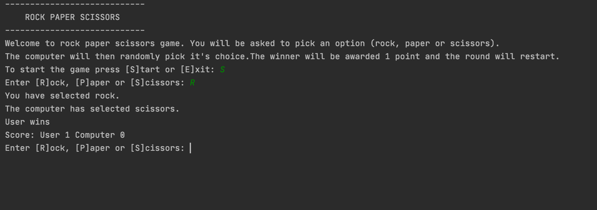

# Rock paper scissors
Simple rock paper scissors game made using Python.

**Instructions:** run the `program.py` script on PyCharm and enter "R" for rock, "P" for paper or "S" for scissors. The computer will randomly select a choice and determine the winner. The winner is awarded one point and the scoreboard is displayed. The game then restarts.

## Screenshot

